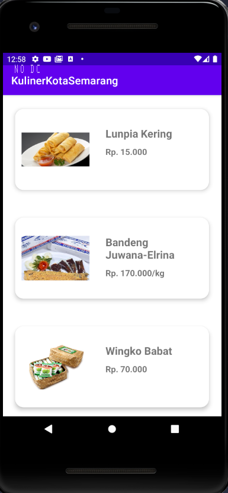

# Kuliner Semarang


_"Lawang Sewu Building in Semarang, Flat Line Illustration"_ oleh [Nur Arifah](https://dribbble.com/nur_arifah)

<div id="kuliner-semarang"/>

Aplkasi sederhana yang menampilkan daftar kuliner
di kota Semarang. Dibuat dengan Android Studio dalam bahasa Java.

- [Kuliner Semarang](#kuliner-semarang)
- 📝 [Penjelasan Singkat](#short-desc)
- 🧰 Tools
  -  [Android Studio](#android-studio)
  -  [Dependencies](#dependencies)
- 🖼 [Tampilan](#tampilan)
  -  [Halaman Utama](#homepage)
  - 🔍 [Detail](#details)
- 📚 [Sumber Belajar](#sources)

<div id="short-desc"/>

## 📝 Penjelasan Singkat

> Aplikasi ini masih menggunakan data yang dideklarasikan secara langsung, belum menggunakan interaksi dengan database.

Layout yang digunakan : `ConstraintLayout`, `LinearLayout`, `RelativeLayout`, `RecyclerView`, `CardView`

Untuk menambahkan dependency ini, cukup tambahkan di dalam file `build.gradle (Module:[nama projectnya])`. Selanjutnya, cari bagian :

```gradle
    dependencies {

    }
```

lalu isi dengan _implementation_ dari tiap depedency.

> File implementation `androidx.recyclerview:recyclerview:1.2.1` ini bisa ditemui di dalam bagian `Gradle Scripts` dari project.
>
> > Untuk mengubah tipe tampilan `Project` sidebar, klik kiri pada anak panah bawah di sebelah tipe tampilan saat ini, lalu pilih `Android`

<div id="android-studio"/>

###  Android Studio

Berikut adalah spesifikasi Android Studio yang saya
gunakan.

- [Android Studio Arctic Fox 2020.3.1](https://developer.android.com/studio)
- Android Image API 30

<div id="dependencies"/>

###  Dependencies

- [CardView 1.0.0](https://developer.android.com/jetpack/androidx/releases/cardview?hl=en)

```gradle
    dependencies {
        //dependency 1
        //dependency 2
        implementation 'androidx.cardview:cardview:1.0.0'

    }
```

- [RecyclerView 1.2.1](https://developer.android.com/jetpack/androidx/releases/recyclerview?hl=en)

```gradle
    dependencies {
        implementation 'androidx.recyclerview:recyclerview:1.2.1'
    }
```

<div id="tampilan"></div>

### 🖼 Tampilan

Berikut tampilan aplikasi ketika dijalankan.

<div id="homepage"></div>

####  Homepage



<div id="details"></div>

#### 🔍 Detail


<div id="sources"></div>

### 📚 Sumber Belajar

Berikut adalah sumber belajar yang saya gunakan.

> Silahkan coba klik salah satu gambar. Sumber berikut berupa video YouTube.

1. Membuat Aplikasi List Kuliner oleh Bapak Fahri Firdausillah, Dosen UDINUS

   [](https://www.youtube.com/watch?v=zQpKmnNehb0&list=PLVslXNopr4TnQ4WSWY6_Jysg0e61RN00l&index=17 "Studi Kasus Aplikasi ")

2. RecyclerView OnClickListener to New Activity Android Studio | Beginner's Guide oleh Ben O'Brien

   [](https://www.youtube.com/watch?v=vBxNDtyE_Co&list=PLVslXNopr4TnQ4WSWY6_Jysg0e61RN00l&index=20 "RecyclerView OnClickListener to New Activity Android Studio")

3. Recyclerview with Cardview in Android Studio Part 1: Display items oleh AndroidWorldClub

   [](https://www.youtube.com/watch?v=oq_xGMN0mRE&list=PLVslXNopr4TnQ4WSWY6_Jysg0e61RN00l&index=19 "RecyclerView with CardView")
